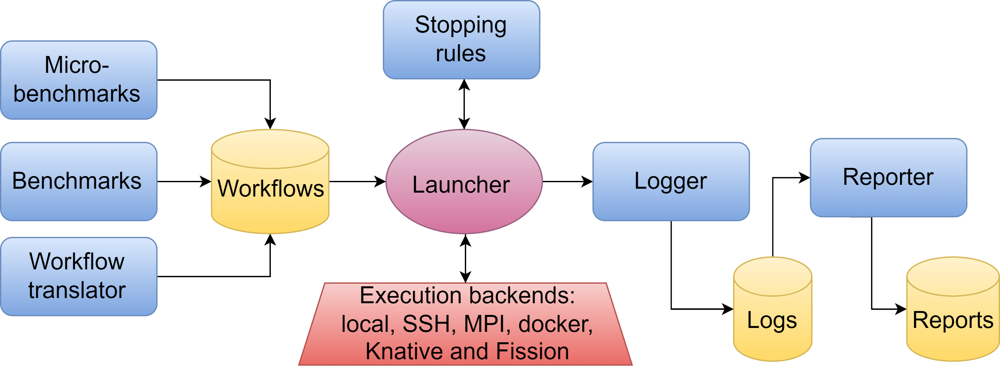

# Task launching framework

The scripts in this folder provide a simple load-generation generic framework that can combine the launching of a task under different job-launching backends with a single, uniform interface.
The main interface is provided by `launch.py` and its command-line arguments, as described in detail below.

## Architecture

The overall architecture of SHARP, and where launcher fits in, is visualized in this figure:
<p align=center>

</p>

Launcher is the module that takes in work (from a workload, makefile, command-line invocation, or even GUI) and coordinates its execution on the selected backend, decides when to stop it, and logs all the run data to CSV and metadata files.

## Concepts

The following terms can help clarify how this script works:

 * Experiment: A collection of one or more jobs (typically just one).
 * job: A collection or sequence of tasks, representing possibly a complete application or benchmark.
 * task: A collection of function invocations, all being the same function with the same arguments, but can run concurrently with a given number of copies.
 * function: An atomic unit of computation in Python, typically a short script or a FaaS entry point/trigger.

So, for example, you could think of a benchmarking job consisting of the following tasks:

1. swapbytes-1: 10 copies of the `swapbytes` function to do the I/O in preparation of computation.
2. inc: 15 copies of the `inc` (CPU) function, run after swapbytes-1.
3. cuda-inc: 5 copies of the `cuda-inc` function, run concurrently with inc-cpu.
4. swapbytes-2: 10 copies of the `swapbytes` function to do the I/O of summarizing the computational results (with different parameters than swapbytes-1). Run after tasks #2 and #3.


## Log files

The execution of each task creates a separate log file, with the task as the filename (which is why tasks in the same job need unique names). The log is a CSV file with one row per copy of the function, and one column for each header and run field.

A header field is a field whose value is the same for the entire task, such as the task name or total run time. A run field is a value that is specific to a single copy (function invocation) within the task. Header fields are redundant, but are there so that the data from different tasks can be merged onto a single data table, but different tasks can still be distinguished even if they invoke the same function, as in the previous example.

In addition to the CSV file, a per-task human-readable markdown file is created with a short description of the task and all the options used in its invocation. The file is called task.md, substituting for the actual task name.
The markdown file also contains specific information identifying the system-under-test, including hardware and operating-system descriptors.
The different sections for system information, and the commands to generate their data, can be found in default_config.yaml and may be overriden by your own configuration.

The location of log files is under a per-experiment directory. The top-level directory customizable and defaults to `../runlogs`.

## Invocation

The main tool to generate load for benchmarking is the function launcher (`launcher/launch.py`).
It is a flexible tool with many optional configuration points, which are documented here.
All options have default values.
The only required argument to `launch.py` is the name of the function you want to run.
For the complete documentation of options, see "Command-line interface" below.


## Command-line interface

The primary way to control most major behavior of `launch.py` is via command-line arguments.
Some configuration choices don't have a command-line option to change them, but you can modify them by providing a configuration file (YAML/JSON) or a JSON string in the command line.
Launcher handles option sources in a particular priority order, with each subsequent source potentially overriding previous options:

    * Previous .md file with --repro flag
    * Config file(s) with -f flag
    * JSON string with -j flag
    * Remaining-command line flags.


Generally, command-line options override those from a previous run, except for backends, where command-line backends are composed with the previous ones.
To see a summary of the options supported by the command line and their default values, type:

```sh
launcher/launch.py -h
```

The rest of the command line options control the following behaviors:

 * `-b` is the most important parameter and specificed the backend to run the function on. It defaults to invoking the function's file directly on the local host. Additional backend options can be passed via config files/strings.
 * `-r` controls the experiment repeating criteria. It can be as simple as passing a fixed number of experiment repetitions, or much more sophisticated dynamic stopping rules. See section on repeaters below for details.
 * `--mpl` controls the multiprogramming level, or how many concurrent instances of the function to run.
 * `-d` gives a description string of this experiment, to be stored in the log files.
 * `-e` names this experiment, which also becomes the directory name for the experiment's log files.
 * `-t` names the specific task in this experiment, which also becomes the log filename. It defaults to the function's name.
 * `--timetout` specifies after how many seconds to give up on a function if it hasn't terminated yet.
 * `-i` lets you specify a file to replace the standard input for the function, if it requires inputs.
 * `-a` runs the experiment in append mode, not overwriting previous results in the log file.
 * `-c` / `-w` can unload or pre-load the function respectively for a "cold" or "hot" run.
 * `-f` lets you pass additional options via one or more configuration files (explained below)
 * `-j` lets you pass additional options via a literal JSON string (explained below)
 * `-v` turns on verbose mode to show interim run data.

## Configuration files

You can pass one or more configuration files---passing multiple files lets you compose options for different modules, for example, one configuration file for the repeater options and another for the experiment options.
In case of conflicts among options, each subsequent configuration file overrides the previous file (and command line arguments).

The format of the file is a simple JSON or YAML dictionary, mapping from option names to values, based on the command-line full-length string options. For example:

```json
{
    "repeats": "HDI",
    "experiment: "just a test"
}
```

## JSON strings

A command-line JSON string serves the same purpose as a configuration file (and overrides all configuration files). It can be used to configure launcher behavior without creating or editing configuration files. For example:

```sh
launch.py -v -f conf1.json,conf2.yaml  -j '{ "repeater_options": { "verbose": true, "max":35, "error_threshold": 0.15}, "repeats": "BB" }' inc 10000 100
```
## Backends

SHARP currently supports the following backends (execution environments) on which the function can be run. Not all functions can run as expected on all backends. For example, to use the MPI backend effectively, the program must use the MPI library.
Backends that require options take them as part of the configuration, specified as a dictionary. The configuration file/string includes a list of backends, each represented as a dictionary where the `type` entry specifies the name/type of the backend, and any other entries are optional and context-dependent, as specified next.

1. `local`: Default environment, just runs the function/script locally. Takes no options.

2. `ssh`: Run the function/script on one or more remote hosts. These hosts are configured under "backend_options"/"ssh" and are specified either with the `hosts` entry (comma-separated list of hosts) or `hostfile` entry (filename to read host names from). When more than one host is specified, is function is executed on a host selected from the list in round-robin fashion.

3. `mpi`: Run the program using `mpirun`. Takes an optional `flags` option (string) from the "backend_options"/"mpi" configuration that includes a space-separated list of optional arguments to pass to mpirun, such as the host names to run on.

4. `fission`: A FaaS backend that executions the function as configured in the Fission setup process. Takes no options.

### Custom backends

You can define your own backend or execution environment as a wrapper around the function/program you want to benchmark. This can be done in two ways:

#### 1. YAML-based Custom Backends

The primary purpose of custom backends is the ability to add measures (i.e., metrics) that are external to the benchmark, collected by some wrapper defined in its own configuration.
For example, you can add a layer to measure the memory consumption of the program using `/usr/bin/time`.
To do that, you might run something like:

```
./launcher.py -f memory.yaml -b local -b memory /bin/ls -l
```

This run will add a new `max_rss` column to the output CSV file with the memory consumption in KB.

Note that we can chain (compose) multiple backends together as separate `-b` parameters, just as we can include multiple configuration excerpts with multiple `-f` parameters.
So adding three new wrappers would likely require three separate `-f` parameters with their configurations and three separate `-b` parameters invoking them.
The order of parameters matters, since each backend executes (wraps around) the next backend in the command line order.
In other words, running with `-b ssh -b memory /bin/ls` will record the memory consmuption of th the `ls` program on the remote node, but running with `-b memory -b ssh /bin/ls` will record the memory consumption of the `ssh` client on the local machine, not of `ls`.

The configuration of a custom backend, which can be provided by a file or the command line (using `-j`), consists of several parts, but only one mandatory. Here's the YAML configuration for the memory example above:

```yaml
backend_options:
  memory:
    reset: ''      # Optional command for cold-starts
    run: /usr/bin/time --verbose $CMD  # Required command wrapper
    run_sys_spec: $SPEC_COMMAND  # Optional system spec command wrapper
metrics:
  max_rss:
    description: Maximum resident set size
    extract: 'sed -nr ''s/Maximum resident set size \(kbytes\): ([0-9]+).*/\1/p'''
    lower_is_better: true
    type: numeric
    units: kbytes
```

You need to add a new entry (dictionary) under "backend_options" with the name of the backend. The dictionary includes an optional `reset` command and a mandatory `run` command. The former is used to initialize cold-starts, and the latter is used to inoke the custom backend.
Both strings accept special macros that will be substituted for the actual values at run time:

 * `$TASK`: replaced with the name of the task
 * `$FN`: replaced with the name of the function
 * `$ARGS`: The arguments to the function/program
 * `$CMD`: The command string to execute, either the function/program, or if composing backends, the next backend to run

Then, you can add one or more metrics that process the output of this new backend. The example above shows how the maximum resident set size (RAM) of the program is extracted from the program of `/usr/bin/time`.

#### 2. Python-based Custom Backends

For more complex backends that require programmatic control, you can create a Python class that inherits from the `Launcher` base class. This approach gives you full control over how tasks are executed and monitored.

To create a Python backend:

1. Create a new class that inherits from `Launcher`:
```python
from launcher import Launcher
from typing import *

class MyCustomLauncher(Launcher):
    def __init__(self, backend: str, options: Dict[str, Any]) -> None:
        """Initialize launcher with backend-specific options."""
        super().__init__(backend, options)
        # Initialize your backend-specific attributes

    def reset(self) -> None:
        """Reset all caches and stale data for cold starts."""
        super().reset()
        # Add backend-specific reset logic

    def run_commands(self, copies: int, nested: str = "") -> List[str]:
        """
        Generate command strings to execute tasks.

        Args:
            copies: How many instances of the task to run
            nested: Nested commands to call instead of function

        Returns:
            List of command strings to execute
        """
        # Must be implemented: generate command strings for your backend
        return []

    def sys_spec_commands(self) -> Dict[str, str]:
        """
        Generate commands to obtain system specifications.

        Returns:
            Dictionary mapping spec names to commands
        """
        # Override to customize how system specs are collected
        return self._sys_spec
```

2. Implement the required methods:
   - `run_commands(self, copies: int, nested: str = "") -> List[str]`: Generate the command strings to execute
   - Optionally override `reset()` for cold-start behavior
   - Optionally override `sys_spec_commands()` for custom system specification handling

See `backends/ssh.py` for a complete example of a Python-based backend.

See more custom backend example YAML files under `backends/`, refer here:(`docs/backends.md`).

## Repeaters

Repeaters are choices of stopping rules that tell the launche when to stop an experiment based on various criteria such as the convergence of a metric.
Repeaters can take more complex configuration options.
If you want to override their default values, you must provide these options in a configuration file or JSON string as described above.
All of the repeater options are described below and should be given as a sub-dictionary called "repeater_options". For example:

```json
{
    "repeats": "HDI",
    "repeater_options": {
        "min": 10,
        "max": 100,
        "error_threshold": 0.15,
        "verbose": true
    }
}
```

All repeaters support the following three configuration options:

 * `max`: Maximum number of repetitions, regardless of other criteria.
 * `verbose`: Controls whether to print extra information to elucidate why the algorithm stops when it does.
 * `metric`: The name of the performance metric that needs to converge (default: `inner_time`).

The full list of available repeaters and their options is listed next, using their short name as used in the `-r` argument.
For complete algorithm documentation, refer to the source code (`launcher/repeater.py`).

### MAX

MAX (or CountRepeater) is the default stopping rule.
It stops exactly after `max` measurements.

### SE

SE looks at the standard error of all the samples collected so far, and stops when it drops below a certain threshold (normalized by the mean of the sample, so it's unitless).
It is most suitable when the metric of interest is normally distributed, such as the mean run time.

Parameters:

 * `min`: Minimum number of repetitions before even looking at SE, regardless of other criteria.
 * `error_threshold`: the normalized standard error below which the experiment stops.


### CI

CI stops the experiment when the confidence interval shrinks to a certain width, relative to the mean.
More formally, it stops when the `p`-% right-tailed Gaussian confidence interval of all measurements is smaller than a threshold proportion of mean.
Again, this works best when the metric is normally distributed.
See [here](https://janhove.github.io/design/2017/09/19/peeking-confidence-intervals) for a discussion of the merits of the CI criteraion.

Parameters:

 * `min`: Minimum number of repetitions before even looking at CI, regardless of other criteria.
 * `ci_limit`: The value `p` for the confidence interval.
 * `error_threshold`: the proportion of the mean under which the confidence interval must shrink before the experiment stops.


### HDI

HDI is a Bayesian stopping rule that similar to CI, stops when the `p`-% highest-density interval of all runtime measurements is smaller than a threshold proportion of mean.
Unlike CI, it doesn't require a normal distribution and can even work with modal distributions.
However, if the inherent noise of the task exceeds the error threshold, this method will never converge and will only stop when it reaches `max`.
For definitions and computations of HDI, see [here](https://www.sciencedirect.com/topics/mathematics/highest-density-interval).
For a discussion of the merits of the CI criteraion, see [here](https://www.sciencedirect.com/topics/mathematics/highest-density-interval).


Parameters:

 * `min`: Minimum number of repetitions, regardless of other criteria.
 * `hdi_limit`: The value `p` for the highest-density interval.
 * `error_threshold`: the proportion of the mean under which the highest-density interval must shrink before the experiment stops.


### BB

The Block Bootstraping criterion stops repeating experiments when the `cl`-% confidence interval of the mean of samples obtained using the block boostrap method remains stable.
This method resamples from all previous measurements `num_samples` times, each sample being at least `block-size` contiguous measurements to account for performance phases.
It then compares the means of these samples from one iteration of the experiment for the next.
The goal of this method is to account for self-correlations in time series that can cause transient effects in performance by sampling using blocks.
It is based on the paper: ["Performance Testing for Cloud Computing with Dependent Data Bootstrapping"](https://doi.org/10.1109/ASE51524.2021.9678687).

Parameters:

 * `min`: Minimum number of repetitions, regardless of other criteria.
 * `cl_limit`: The value `cl` for the highest-density interval.
 * `error_threshold`: the allowed range for the `cl-%` CI of the differences from the previous run to this one in means of the block-bootstrapped samples.
 * `num_samples`: How many times to resample from the past measurements when bootrstrapping.
 * `epsilon`: `block_size` is determined by finding the minimum block size where autocorrelation is negligible, or less than `epsilon`, this parameter.

### GMM

The GaussianMixtureRepeater fits a Gaussian Mixture model to
current measurements, and stops if the goodness of fit of the
model above a threshold.

This repeater uses the
[GaussianMixture model](https://scikit-learn.org/stable/modules/generated/sklearn.mixture.GaussianMixture.html)
from sklearn, and the best fit is found by optimizing the
[BIC score](https://en.wikipedia.org/wiki/Bayesian_information_criterion).

Parameters:

 * `gm_goodness_threshold`: Likelihood value that triggers stopping (default: `2`)
 * `max_gaussian_components`: Maximum gaussian components used in the model (default: `8`)
 * `gaussian_covariances`: List of strings with covariance modes to be tested (default: `["spherical", "tied", "diag", "full"]`)

### DecisionRepeater (DR)

The DecisionRepeater uses other repeaters to determine when to stop.  It employs
a series of statistical tests, described in this classes' functions, to
determine which repeater will be consulted to decide if it's time to stop.

Because of the number of distinct tests performed, this repeater has a large
number of parameters. Additionally, each sub-repeater used in this repeater
accepts its own parameters. The parameters of this class control the strictness
of each statistical test, and the sub-repeaters' parameters control the
strictness of the stopping rule encapsulated in each repeater.

#### Arguments (see function inline documentation for each individual test)

 * `decision_verbose`: Print information about succeeding tests (default: `False`)
 * `p_threshold`: P-value threshold for various tests (default: `0.1`)
 * `lognormal_threshold`: P-value threshold for lognormal test (default: `0.1`)
 * `gaussian_threshold`: Threshold for the gaussian test (default: `0.2`)
 * `uniform_threshold`: Threshold for the uniform test (default: `0.2`)
 * `mean_threshold`: Threshold for the mean test (default: `0.1`)
 * `autocor_threshold`: Threshold for the autocorrelation test (default: `0.8`)

#### Arguments for the multimodal detection test

 * `goodness_threshold`: Likelihood value that triggers stopping (default: `2`)
 * `max_gaussian_components`: Maximum gaussian components used in the model (default: `8`)
 * `gaussian_covariances`: List of strings with covariance modes to be tested (default: `["spherical", "tied", "diag", "full"]`)

#### Selecting sub-repeaters with `repeaters`

This should be a dictionary where the keys are repeater names, such
as "SERepeater", and the corresponding values are dictionaries with
instances of the repeater and a boolean for the last decision made
by the repeater. For example, a valid repeaters dictionary is:

```python
{ "SERepeater": { "repeater": SERepeater(options), "last_decision": True } }
```

Default (looks for sub-repeater options in the same dictionary):

```python
{"SERepeater": {"repeater": SERepeater(options),
                "last_decision": True},
"CIRepeater": {"repeater": CIRepeater(options),
                "last_decision": True},
"HDIRepeater": {"repeater": HDIRepeater(options),
                "last_decision": True},
"BBRepeater": {"repeater": BBRepeater(options),
                "last_decision": True},
"GaussianMixtureRepeater": {"repeater": GaussianMixtureRepeater(options),
                            "last_decision": True}}
```

## Extending to other backends

The code is designed to be extensible. Every backend is represented by a launcher class that needs to implement a small API for its own backend. The API is described in the parent class Launcher (in `launcher.py`). A new subclass for a new backend merely needs to override whatever function makes sense. Minimally, the `__call__()` operator that actually invokes the function needs to be overridden. Additional, per-backend options can still be passed via the `options` dictionary.

We provide PEP-484 type annotations for all components of the launcher. This should help understand the relevant APIs. It is recommended to check for type errors using `mypy` (install with `python3 -m pip install mypy`):

```sh
# from the repository root directory, where mypy.ini resides
mypy launcher
```

## Using other programming languages

If you're using a FaaS backend like Fission, then `launch.py` doesn't care about the function's programming language. As long as you've registered it properly with the FaaS backend under a name `func`, `launch.py` will just use that name.

If you're using a direct-execution backend like local, mpi, or ssh, `launch.py` needs to figure out what to execute. It will do so by searching for the **first file in the function's directory to be both executable and named func.ext**, where func is the function name and .ext is (optionally) any extension such as `.py`.
This naming convention suggests that your program file must be fully executable on its own, without explicitly passing it to an interpreter. For scripts, you can accomplish this using [shebang](https://www.cyberciti.biz/tips/finding-bash-perl-python-portably-using-env.html).
