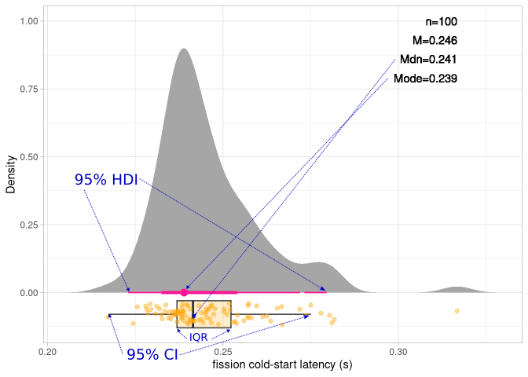

# Benchmark execution and reporting

## Setup

To run benchmarks, you'll have to ensure that the individual functions they call are all set up correctly with their prerequisites.
To create reports, you need to be running docker and have created the `reporter` image from the Dockerfile in this directory.

Both of these tasks are explained in more detail in the SHARP [setup](../docs/setup/README.md) guide.

## Running benchmarks

The top-level interface to running benchmarks and compiling a report of the results is through the `Makefile` in this directory.
Simply typing `make` results in running all available examples (all subdirectories), and producing a single report that includes all the results.

The two steps involved are (1) iterating over every selected benchmark and producing its own output CSV files; and (2) compiling a human-readable report that includes information about the system under test, one section with results and narrative for each benchmark, and summary statistics.
The makefile ensures that no benchmarks are rerun if they'd already produced results and none of their input dependencies have changed.

The report is produced in various formats including PDF, HTML, LaTeX, Word, and Powerpoint. it can be found in the directory `../reports/X-Y/`, where `X` is the name of the experiment (defaults to 'misc'), and `Y` is the name of the backend under test (defaults to 'fission').
If this directory already exists when running `make`, it will fail, so that it doesn't overwrite previous reports. Either rename the experiment or delete the directory to rerun.

### Parameters

You can configure the benchmarks and reports by passing the following parameters (with the syntax `make param=value`):

 * `benchmarks`: list of selected subdirectories/benchmarks to run and include in the report, if not all are desired. For example: `make benchmarks="parallel_sleep start_latency"`.
 * `backend`: The FaaS/job-launcher backend you want to measure.
 * `experiment`: The name of the experiment (and part of the reports subdirectory name). Defaults to 'misc'.

## Implemented examples

The following benchmarks can be run (click for more documentation):

 * [parallel-sleep](../docs/examples/psleep.md): A measure of FaaS elasticity.
 * [start-latency](../docs/examples/start-latency.md): A comparison of FaaS hot and cold starts.

## Interpreting distribution graphs

The performance sections may include distribution plots for the measured performance metrics.
Here's an example of what a distribution graph produced by `create_distribution_plot()` might look like:

The actual measurements show up as organge points on the bottom of the graph, with some random vertical jitter to help distnguish indivudual points in the croweded area.

Overlaid on top of these points is a boxplot showing the median value (central bar), the 25th and 75th percentiles or interquartile range (left and right bar, respectively), and the 95% confidence interval (length of horizontal bar).

The main body of the graph shows the probability density of the measurements, such that the gray area adds up to 1.0.

On the y-axis, a pink line shows the Bayseian 95% high-density interval, with a point denoting the mode. You can read more about the difference between HDI and CI [here](https://easystats.github.io/bayestestR/articles/credible_interval.html)

On the top right, the following values are listed: number of samples (n), mean value of measurement (M), median value (Mdn), and mode (Mode).

## Adding benchmarks

Adding a new benchmark involves the following task:

 1. Creating a subdirectory with the (unique) benchmark's name. Everything else goes inside this subdirectory.
 2. Creating workflow, in the form of a Makefile. This Makefile determines the desired output files of your measurements and their input dependencies. An easy starting point is any of the existing benchmarks' Makefiles, which you can copy from. You can also use the tools in `../workflows` to create a Makefile from higher-level description languages, but make sure to rename it to `Makefile` when placed in the benchmark subdirectory. Either way, make sure the resulting Makefile includes required target `csv` abd the following required variable definitions: (a) `id`: the name of task; (b) `outputs`: a list of output filenames; and (c) `description`: a free-form phrase describing the benchmark.
 3. An RMarkdown file that contains the narrative and the desired statistics and graphics for the report section of this benchmark (see existing examples).
 4. A `_bookdown.yml` file with the title for the benchmark's subreport and any output options (see existing examples).

### Testing individual examples

The existing benchmarks are designed so that you can produce a "mini-report" for each one from their own directory level, ignoring all other benchmarks and skipping the productions of chapters 1 and 3 from the general report.
If you simply type `make` in an experiment's subdirectory, it will produce this mini-report in the appropriate subdirectory under `../runlogs`.
This feature, which you should implement in your own benchmarks as well by copying the `all` target from another Makefile, is only meant for quick debugging. For actual benchmark reporting you should use the top-level Makefile, even if you're only running it with a single benchmark.

### Utilities

There are two files in this directory to simply the tasks of writing the Makefile and the RMarkdown file.

The file `common.mk` sets some commonly used variables, checks that you've set the specific variables you're supposed to, and provides a generic rule to produce a PDF report for an individual benchmark (see "Testing individual benchmarks" above).

The file `common.R` contains some R utilities to help standardize your report template, such as how to create tables with summary statistics for your distribution (which carry forward to the final summary table of the report); how to create distribution plots, and how to report various statistical hypothesis tests (t, chi-square, correlation, etc.).

### Under the hood

This section comtains additional information for those who want to dive deeper or modify the default behaviors. It's not required reading for adding new benchmarks.

The RMarkdown is converted to PDF and other report formats using a combination of tools: R, pandoc, latex, and myriad packages.
Instead of requiring the user to install all these dependencies (some of which can be finicky), the Makefiles simply invoke them in the `reporter` Docker container you've created in the setup stage.
If you'd like your R code to use additional packages, or if you want to change any of the versions of the packages, simply edit the `Dockerfile` or `deps.R` file as necessary and rebuild the `reporter` image.

Note that any parameters you want to pass to to the RMarkdown script can be passed as environment variables, using Docker's `-e` flag. See the top-level Makefile for examples.

The file `common.mk`, which all subdirectory Makefiles should include *in their last line*, contains some shared base variables that you may want to reuse in your Makefile.
It also contains some common targets, such as the (individual) pdf output and `clean`.
Your own Makefile should include some of the same standard rules as the existing Makefiles: `all`, `csv` (an [empty target](https://www.gnu.org/software/make/manual/html_node/Empty-Targets.html#:~:text=The%20empty%20target%20is%20a,matter%2C%20and%20usually%20are%20empty.)), and most importantly, `outputs`, which is the top level for your benchmark's workflow.

The top-level report template, `report.Rmd`, contains a three-chapter structure: system description, benchmark results, and summary table.
Only the first chapter is explicity included in this file.
All other chapters and sections are added via the `rmd_files` variable that is written into an ad-hoc `report.yml` file, created dynamically by the Makefile from the list of benchmarks.
The last file in this list is always `summary.Rmd`, which is a template for the final summary table, including all previous summary tables created by individual benchmarks.
To achieve this, a global variable called `all.summary` is first created by `report.Rmd`; is appended to every time you call `compute_summary` from your benchmark, and is finally pretty-printed in `summary.Rmd`.
