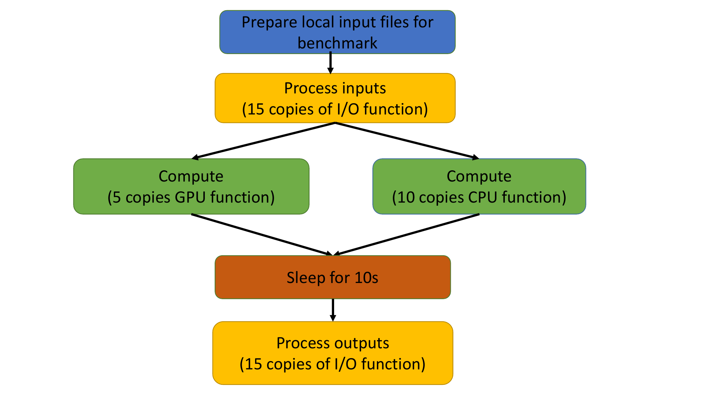

# Benchmarking workflows

This directory contains a set of tools to help you convert or create your own workflows.
The primary format of workflows is simply Makefiles, because all `launch.py` invocations produce independent log files, and Makefiles can express dependencies between files that `make` can easily execute.
However, Makefile format can be arcane and hard to read.
If you'd rather write your workflows in a more human-readable format, you can use the `cncf2mk.py` script described [here](../docs/cncf2mk.md).
That file also contains instructions for validating the formatting of your CNCF file.


# Example: simple DAG workflow

The best way to understand the formats of both the workflow files and Makefiles is with an example.
Imagine, for example, a workflow that starts by creating a couple of input files locally to be used in the benchmark, does some I/O on one of the files, processes some data in parallel in the CPU and the GPU, and then sleep for 10s and does some I/O on the second file.
The first task merely prepares for the benchmark and the sleep task merely controls its timing.
All the rest are benchmarking tasks that need to be timed and logged by `launcher.py`.
This workflow represents a directed acyclic graph (DAG), that could be depicted by this figure:



In the CNCF format, this workflow could be represented as either a JSON file or YAML file.
The latter looks like [this](simple-dag.yaml).
To execute this workflow, simply run:

```sh
make -j -f simple-dag.mk
```


Then, if you run:
```sh
./cncf2mk.py simple-dag.yaml
```
you'll end up with a new Makefile that looks like [this](./simple-dag.mk).

## Complex example

Another example with simple loops can be found [here](./stage1.yaml), or converted to [Makefile](./stage1.mk).
A more elaborate example can be found in either [JSON](./example-workflow.json) or [YAML](./example-workflow.yaml).
You can try converting it to a Makefile and running it yourself.

## Library of preexisting workflows

TBD

